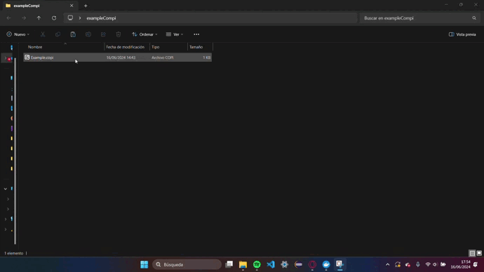
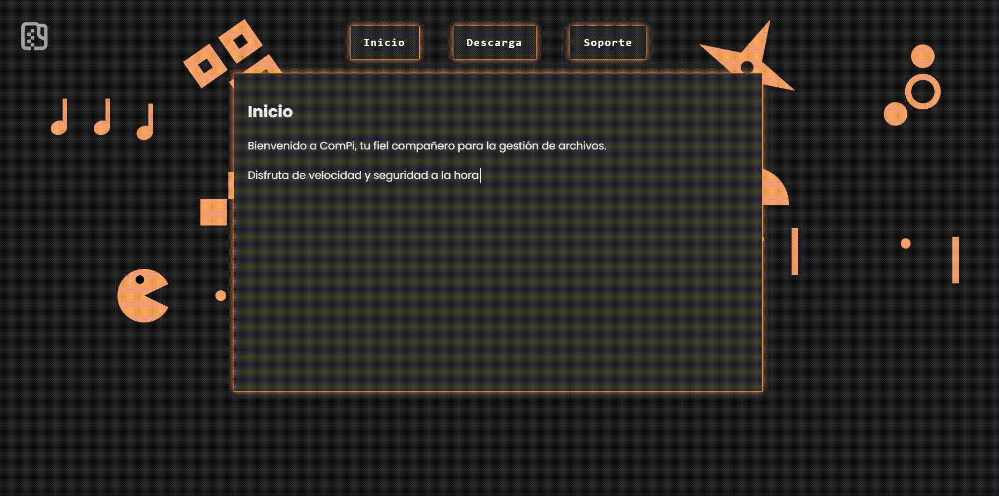

<!-- PROJECT LOGO -->
 

  

<h3 align="center">ComPi</h3>

  

ComPi is an efficient file compression tool akin to WinRAR, designed to streamline file management and reduce storage space. Developed as part of a Final Year Project (TFG), ComPi integrates seamlessly into the Windows context menu, offering a user-friendly interface for both novice and advanced users. This project underscores the developers' proficiency in software development and their ability to deliver practical solutions to common computing problems.
     
     
     
  

<!-- TABLE OF CONTENTS -->

  
Table of Contents

  <ol>
    <li>
      <a href="#about-the-project">About The Project</a>
    </li>
    <li>
      <a href="#getting-started">Getting Started</a>
      <ul>
        <li><a href="#prerequisites">Prerequisites</a></li>
        <li><a href="#installation">Installation</a></li>
      </ul>
    </li>
    <li><a href="#contact">Contact</a></li>
  </ol>

## About The Project

ComPi is a robust file compression application developed by two contributors as part of their final year project. The application offers functionality similar to that of WinRAR, with a focus on ease of use and integration into the Windows operating system.

Key Features:
- Seamless integration with the Windows context menu
- User-friendly interface
- Efficient compression algorithms for faster processing
- Custom file extension `.copi` for compressed files

  

## Getting Started

This section provides the necessary steps to set up and run ComPi on your local machine. Follow the instructions below to ensure a smooth installation and setup process.

### Prerequisites

Before installing ComPi, ensure your system meets the following requirements:

* Windows Operating System

### Installation

1. Download the ComPi installer from the official website:
   [ComPi Download](https://compiapp.netlify.app)
2. Run the installer and follow the on-screen instructions to complete the installation process.
3. The installation will integrate the `.copi` file extension into your operating system.
4. Once installed, open the aplication from your dekstop shortcut or right-click on any `.copi` file.

   

## License

**Note:** ComPi is developed as an academic project and may incorporate third-party resources subject to their respective licenses. Users are advised to comply with all applicable license agreements.

## Contact

For any inquiries or further information, please contact the developers:

Aaron Castro - [aaroncasstroarias@gmail.com](mailto:aaroncasstroarias@gmail.com)

Project Link: [ComPi](https://github.com/aaroncxsstro/ComPi)
